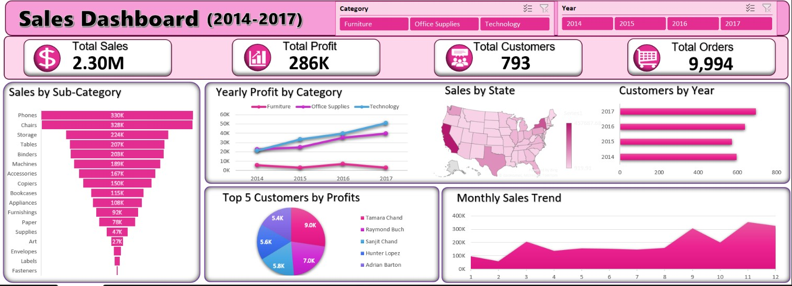

# 📊 Sales Dashboard Analysis (2014–2017)

## Overview

This project is an interactive Sales Dashboard built in Microsoft Excel to analyze sales performance from 2014 to 2017. The dashboard transforms raw sales data into meaningful business insights using Pivot Tables, Pivot Charts, Slicers, and KPI Cards.

The objective of this project is to help businesses monitor sales performance, profitability, customer activity, and regional trends through a visually appealing and interactive dashboard.

---

## Dashboard Preview



---

## Key Performance Indicators (KPIs)

* **Total Sales:** $2.30M
* **Total Profit:** $286K
* **Total Customers:** 793
* **Total Orders:** 9,994

---

## Dashboard Features

### Sales by Sub-Category

Analyzes sales performance across different product sub-categories to identify top-performing products.

### Yearly Profit by Category

Tracks profit trends for Furniture, Office Supplies, and Technology categories from 2014–2017.

### Sales by State

Visualizes state-wise sales distribution to identify high-performing regions.

### Customers by Year

Shows yearly customer activity and growth trends.

### Top 5 Customers by Profit

Highlights the most profitable customers contributing to overall business success.

### Monthly Sales Trend

Displays monthly sales patterns and seasonal performance trends.

### Interactive Slicers

Users can filter dashboard insights by:

* Category
* Year

---

## Tools & Techniques Used

* Microsoft Excel
* Pivot Tables
* Pivot Charts
* Slicers
* KPI Cards
* Custom Number Formatting
* Data Cleaning
* Dashboard Design & Visualization

---

## Business Insights

* Generated over **$2.30 Million** in total sales.
* Achieved **$286 Thousand** in total profit.
* Processed **9,994 orders** from **793 customers**.
* Technology category showed consistent profit growth.
* Certain product sub-categories contributed significantly to total sales.
* Sales performance varied across states, highlighting key regional markets.
* Monthly sales trends revealed periods of increased customer demand.

---

## Project Structure

```text
excel-sales-dashboard-analysis/
│
├── Sales_Analysis_Dashboard.xlsb
├── dashboard_creenshot.png
└── README.md
```

---

## Skills Demonstrated

* Data Analysis
* Data Visualization
* Dashboard Development
* Business Intelligence Reporting
* KPI Tracking
* Excel Analytics
* Data Storytelling
* Interactive Reporting

---

## Author

**Zahid Ernical**

